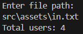

# Unique User Logger

Este projeto é uma aplicação Java que lê registros de log de um arquivo de texto, contabiliza os usuários únicos e exibe o total. Ele utiliza a classe `HashSet` para garantir que não haja duplicação de usuários.

## Estrutura do Projeto

A estrutura do projeto está organizada da seguinte maneira:

- **App.java**: Classe principal que contém a lógica de leitura de arquivos e processamento de usuários únicos.
- **LogEntry.java**: Classe de entidade que representa um registro de log com informações do usuário e data.
- **assets/in.txt**: Arquivo de exemplo usado para testar a aplicação.
- **assets/result.png**: Exemplo visual do resultado gerado.

## Como Funciona

1. O programa solicita o caminho do arquivo de log de entrada.
2. Cada linha do arquivo deve conter o nome do usuário e o timestamp em formato ISO 8601, separados por espaço.
3. O programa analisa os dados, armazena os registros únicos e exibe a contagem de usuários únicos.

### Exemplo de Entrada

Arquivo `src/assets/in.txt`:

### Exemplo Visual de saída

A imagem abaixo ilustra a execução do programa:

